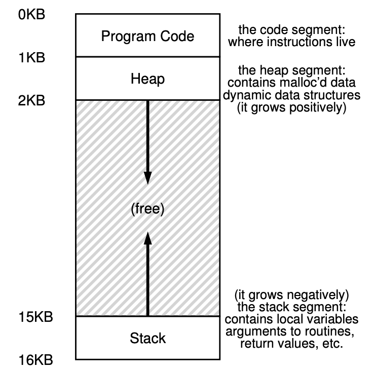
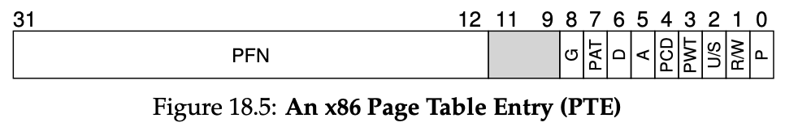

Goals:

- Transparency: the OS should implement virtual memory in a way that is invisible to the running program.
- Efficiency: virtualization should be as efficient as possible, both in terms of time and space.
- Protection: processes (and the OS itself) should be protected from one another.

# Address Spaces

An abstraction of physical memory from the point of view of a running program.

What if a process has an address space of 64KB but we don't have a contiguous portion of 64KB in the physical memory? Not a problem with segmentation!

# Address Translation

The hardware transforms each memory access (instruction fetch, load, store), changing the virtual address provided to a physical address where the information is actually located.

The hardware provides 2 registers (**base and bounds**), located on the MMU (memory management unit, part of the CPU concerned with address translation). 

The base is the start of the address space, and the bounds is its size (or in some systems the final address). 

Here's an example if a process's address space of 4KB is loaded at physical address 16KB.

# Segmentation

Instead of having only a base and bounds pair in our MMU, we have a **base and pounds pair** for each logical segment in our address space. Here we have 3 segments: code, heap and stack.

As you can see, the stack code and heap aren't place contiguously, but independently.

In the example on the left, the stack actually grows upwards. The hardware needs to keep track of this:

To translate a virtual address to physical address, the hardware considers the first 2 bits to be which segment the address is in, then, the remaining bits are the offsets in the address space. It simply adds the offset to the physical address base. If it grows negatively, instead of adding an offset of 3K, it actually adds 3K - maxSize(4K) ⇒ -1K. 

# Free Space Management

Before introducting paging, what are some ways we can manage free space in our physical memory?

After splitting:

Splitting: when we have a request for some bytes of memory, we find a free chunk of memory and split it into 2. The first chunk returns to the caller, the second chunk remains on the list.

Coalescing: when a free chunk of memory is freed, you traverse the list and either place it next to another free chunk of memory, or merge two into a single larger chunk.

When we call free(*ptr) how does the OS know how much memory to free? Well, every block of code has a small header just before it that specifies its size and a magic number usually "1234567" just as a sanity check to make sure the memory isn't corrupter when read.

This is how this free list is implemented in memory:

There are many policies for managing free space. 

- Best fit: out of all the free memory chunks that are big enough to fit, return the smallest. This tries to reduce wasted space, although it's bad performance wise.
- Worst fit: find the largest chunk, and return the requested amount. Keep the remaining of this chunk on the free list. This usually leads to worse fragmentation than best fit, so nah.
- First fit: return first block that is big enough and return the requested amount.
- Next fit: this keeps an extra pointer within the list at the location where one was looking last. Then start looking from there.

Other approaches are keeping a list just for chunks of a certain size, to try to reduce fragmentation of different sizes. 

When that 8KB block is freed, the allocator checks whether the buddy (the other half of the block) is free; if so, it coalesces the two blocks. Then allocator then checks if the upper 16KB buddy is free (the half of this double), if so it coalesces, and recursively goes up the tree like this.

Or there's also buddy allocation: when a request for memory is made, the search for free space recursively divides free space by two until a block that is big enough to accomodate the request is found. This 8KB block is then returned to the user. 

# Intro to Paging

Segmentation: dividing memory into variable-sized chunks, which leads to fragmentation.

Paging: dividing memory into fixed-sized pieces, called pages. Physical memory is then an array of fixed-sized slots called *page frames*, each of these containiong a single *virtual-memory page*.

Example with tiny address space (64 bytes or 6 bits address space). Real address spaces are 32 bits or even 64 bits (mindboggingly big)

To record where each virtual page of the address space is placed in physical memory, the OS keeps a per-process **page table**, storing address translations for each of the virtual pages.

When translating virtual addresses to physical addresses, we split it into two components: the **virtual page number (VPN)** and the **offset** within the page.

In our example, since the address space is 64 bytes, we need 6 bits for a virtual address. We have 4 pages so 2 bits for the VPN. Every page is then 16 bytes, so 4 bits for it.

The MMU only translates the VPN to PFN (physical frame number, or physical page number PPN), the offset stays the same.

We can have hundreds of processes and each page table can be 4MB of memory for a 32-bit address space. Therefore the page tables are stored in memory (or even swapped to disk, topic for later).

How is a page table stored? Can be a simple array of numbers, where each PTE can for example have 32 bits like below. A bunch of flags, like a ***valid bit*** if the particular translation is valid (for only allocated memory). ***Protection bits***, indicating if the page can be read/written/executed from. ***Present bit*** indicates if the page is present in memory or has been swapped out to disk. A ***dirty bit*** to know if the page has been modified since it was brought into memory. ***Accessed bit*** to track whether a page has been accessed (if it's not popular, can be replaced)

What happens on each memory reference? 

1. extract VPN from the virtual address
2. form the address of the page-table entry (PTE)
3. fetch the PTE
4. check if process can access the page
5. form physical address and fetch it

This process is very slow. and also we have to perform one extra memory reference in order to first fetch the PTE from physical memory.

Going to memory for translation information before every instruction fetch or explicit load/store is SOOOOO SLOW!!!!!

Small example, for why we need TLBs:

As you can see, for the small code above, we keep accessing the array which is page 39, and we keep accessing int i which is on page 1, but we could just cache all this translation!

# Translation Lookaside Buffers

The TLB is part of the MMU and is simply a hardware cache of popular virtual-to-physical address translations.

example: consider we have a tiny address sapce, with 4 bytes pages. If we have an array of 10 integers, we're going to need at least 3 pages to store it.

By using a TLB, thanks to **spatial locality**, only 3 memory accesses for the PTEs will be needed! The other times we'll be able to fetch the physical address translation from the TLB.

Our hit rate is 70%.

If the program accesses the array data again, it will achieve a hit rate of 100%, due to **temporal locality**.

**spatial locality** → if program accesses address x, it will probably access memory near x

**temporal locality** → an instruction or data items that has been recently accessed will likely be accessed soon in the future. 

## Who handles TLB misses?

In the old days (CISC, complex-instruction set computers), the hardware would do this. It would walk the page table and update the TLB.

Nowadays, (RISC, reduced-instruction set computers (nowadays CPUs are a mix of both actually)), we have software-managed TLB. On a TLB miss, the hardware raises an exception, which raises the privilege to kernel mode and jumps to a trap handler that deals with it.

## TLB Contents

VPN : PFN : other bits (valid bit (does the entry have a valid translation or not), protection bits (rwx), address space id, dirty bit, etc)

## TLB Issue: Context Switches

The TLB contains virtual-to-physical translations that are only valid for the current process. So when switching from one process to another, what do we do? Two approaches:

- **Flush the TLB** (by setting all its valid bits to 0) → bad cost if change process frequentyl, as each time process runs it incurs TLB misses
- **Address space identifier (ASID)** → processes can share the TLB, holding translations (from the same VPN to a different PFN) from different processes at the same time. The OS must on context switch set some privileged register to the ASID of the current process.

# Advanced Page Tables

Page tables take up too much memory. If using 32bit address space (2^32 bytes), with 4KB (2^12 bytes) pages, and a 4 byte PTE… we have 1 million virtual pages, and a page table is 4MB. for every process.

If we increase the size of our pages, let's say to 16KB, we reduce our page table to 256KB*4KB = 1MB. 

Unfortunately though, big pages lead to internal fragmentation, wasted memory within each page. 

## The problem

See how much wasted space???

Two possible solutions…

## Paging + Segmentation

Instead of having a page table for the entire address of the process, why not have one per logical segment? 

You can have registers that track the base + bounds pointers for each page table. You can have a page table for the code segment, one for the heap and one for the stack.

This leads to external segmentation though, as page tables are now of arbitrary size (not all tables have the same number of PTEs).

## Multi-level Page Tables

Chop up the page table into page-sized units, then, if an entire page of PTEs is invalid, don't allocate that page of the page table at all.

To track if a page of the page table is valid (and if valid, its address in memory), we use a **page directory**. 

As you can see, instead of having 2 empty PTE, we only have 2 empty PDE (Page Directory Entry)! Saving memory. Each PDE has a valid bit and a PFN. The valid bit is valid if any of the pages that the PDE points to are valid as well.

We add a level of indirection through the use of the page directory, which points to pieces of the page table. This allows us to place page-tables pages wherever we want in physical memory.

Advantages: more compact and supports sparse address spaces.

Disadvantage: time-space trade off. We got smaller tables but in case of TLB miss, we have another layer of translation needed - one memory access per level. It's also more complex.

From a virtual address, here are the steps to fetch the physical address:

1. Find PDE:

                     *PDEAddr = PageDirBase + (PDIndex * sizeof(PDE))*

1. If bit is invalid, raise exception. Else, get page table index:

1. Now that we have PTEAddr, access PTE at that location to fetch PFN.

## More Than Two Levels

Look at the page directory above? isnt that a lot of wasted space? The ultime goal of a multi level page table is to fit all PTEs into a single page. We're far from that.

We can add another level or indirection to our page directory. 

A three level page table could look like this:

### Summary w/ TLB

This is what happens in hardware (assuming hardware-managed TLB) upon **every** memory reference. We first check the TLB, otherwise we can have a two-level page table → two additional memory accesses to look up a valid translation.

## Inverted Page Tables

Another approach would be this:

instead of having many page tables (one per process), keep a single page table that has an entry for each *physical page* of the system. The entry tells us which process is using this page, and which virtual page of that process maps to this physical page. 

Linear scanning this data structure is expensive, so this is often implemented as a hash table.

# Swapping Mechanisms

We want to support a large virtual address space for each process, and with multiprogramming there can be hundreds of processes running at the same time. This leads us to use more memory than is physically available.

## Swap Space

We reverse some space on disk for moving pages back and forth, this is called **swap space**. 

## The Present Bit & Page Faults

We add a present bit to a PTE to let the OS know if a page is present (bit 1) in physical memory or (bit 0) present on disk somewhere.

***Page fault*** ⇒ the act of accessing a page that is no in physical memory.

Upon a page fault, the OS is invoked and the **page-fault handler** is run.

The disk address of where the page is stored is saved on the PTE, in the bits normally used for the PFN. Then, on a page fault, the OS will save the new page in-memory location in the PTE and maybe also update it in the TLB. 

While the page-fult handler is working, the process becomes **blocked** and the OS is free to run other ready processes on the CPU.

## Final Control Flow

As you can see from the above page-fault algo, if we can't find a physical page frame, a swapping policy has to kick in that evicts a page.

### Replacements

Replacements don't happen when the memory is full, but actually happen based on some highwatermark (HW) and low watermark (LW).

When the OS notices there are fewer than LW pages available, a background thread called **swap daemon or page daemon** frees memory until there are HW pages available.

Doing this can allow clustering writing swapped-out pages to disk, which reduces disk seek and rotational overheads thus increasing performance.

# Swapping Policies

What if the memory is full? If we can't page in a page from swap space, we have to replace a page in memory.

We do this by keeping in mind our goal is to maximize cache hits.

We also want to minimize the average memory access time (AMAT):

Where T_M is the cost of accessing memory (nanoseconds), T_D the cost of accessing disk (milliseconds) and P_Miss the probability of experiencing a cache miss.

Makes sense, right? you always have to access memory, but you only access the disk on misses. Disks are so slow that a tiny miss rate can greatly increase our AMAT.

## Optimal Replacement Policy

Let's consider a theoretical, optimal replacement policy, that replaces the page that will be accessed *furthest in the future.*

The example above has a hit rate of 6/11 or 54.5%. The hit rate modulo compulsory misses (the cold-start ones) is 85.7%.

## FIFO Policy

The page that was inserted first is evicted first. On our example, FIFO performs with a 36.4% hit rate.

## Random Policy

Easy to implement, over 10'000 trials, it performs not far off from optimal though.

## LRU or LFU → Principle of Locality Algorithms

FIFO and Random are bad because they may kick out an important page. 

If we can't look at the future, let's look at the past:

- LRU evicts the page that was used the least recently used.
- LFU evicts the page that was the least frequently used.

MFU and MRU (most … used) also exist, but these ignore the locality most programs exhibit, instead of embracing it. The principle of locality (spatial locality and temporal locality) is good to follow because heuristically it's what programs usually exhbit. 

- **Spatial locality**: If you access P, you may access P+1 or P-1.
- **Temporal locality**: If you access P, you may access it again later.

## Workload Examples

Comparing the policies against a workload with no locality. We basically pick unique pages all the time. From a cache of 1 to a cache of 100 (all pages)

A more realistic workload. 80% of the references are made to 20% of the pages (the "hot" pages), while the remaining 20% of the references are made to 80% of the pages (the "cold" pages).

Here, we loop over 50 pages in sequence, starting from 0, to 49, to 0 again, etc. As you can see, random performs better than LRU. Random has some nice properties, such as not having weird corner-case like LRU here.

## Implementing LRU

- Moving a page to the end of a linked list per memory reference is a lot of work.
- We could keep a last_used time field for every page, but a linear scan of every page would take too much time.
- Modern systems approximate it!

### Approximating LRU w/ the clock algorithm

Every page (maybe in the page table) has a use bit. When referenced, the bit is set to 1 by the hardware. 

A clock hand points to some page to begin with. When a replacement must occur, the OS checks if the currently-pointed page has a use bit of 1 or of 0. If it has a use bit of 1, it must be that this page has been recently used. Then the OS clears the bit (sets it to 0) and continues. As soon as it finds a page with a use bit of 0, it evicts it.

### Considering Dirty Pages

A dirty page is a page that has been modified. Some systems prefer to evict clean pages over dirty pages, because the dirty ones have to be written to disk when evicted (additional I/O overhead). To support this, the hardware included a dirty bit. The clock algorithm could scan for pages that are both unused and clean, failing to find those, then for unused but dirty, etc…

## Other virtual memory policies

Other than page replacement, there's policies for ***prefetching*** pages, for example if page P is brought into memory, P+1 could be too.

Another policy is clustering page writes to disk together.

## Thrashing

Thrashing is a condition where memory demands from the running processes exceeds the available physical memory. In this case, the system will constantly be paging.

Older systems had a policy of not running too many processes, in hopes of keeping the demanded memory low → (it's better to do less work well than try to do everything at once poorly).

Some current systems take a more draconian approach → an out-of-memory killer daemon that when memory is oversubscribed, it chooses a memory-intensive process and kills it (what if it kills a server loool)
